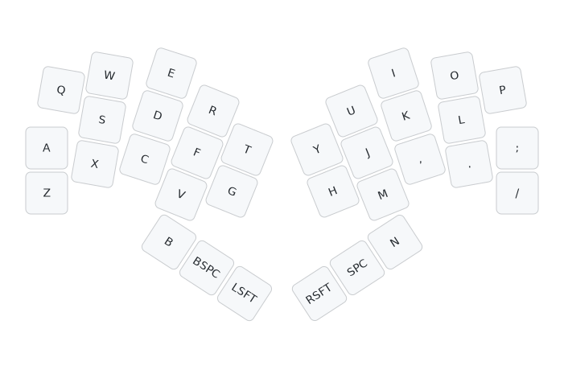

# Bivouac34 keyboard firmware

You can [download pre-compiled TC36K firmware](https://github.com/peterjc/qmk_userspace/releases),
`bivouac34_vial.uf2` with Vial support is recommended as you can the use
the [Vial GUI tool](https://get.vial.today/) to configure your layout by point-and-click.
This is the default keymap:

This is firmware for a Raspberry Pi PR2040-Zero controller monoblock 34 key design
(split 33332_3, four columns of three, inner column of two, and three thumb keys,
for each hand): the [Bivouac34 keyboard](https://codeberg.org/peterjc/pico-keyboards/src/branch/main/bivouac34).

This is a *diode-free* design with a sparse 10 by 10 scanning matrix designed using
the [unique 20 vertex girth 6 graph of maximal 34 edges](https://houseofgraphs.org/graphs/55819)
(using only 20 vertices or GPIO pins, with 34 edges or keys with 4KRO - see this
[blog post](https://astrobeano.blogspot.com/2025/05/topology-meets-custom-keyboard-circuit.html)
for background.

This matrix shows the 10×10 sparse bipartite scanning matrix. The keys are assigned so the
scanning column order matches the physical columns (starting with Q, A, and Z as the first
column), with the scanning rows sorted to ensure Q is top left as the first matrix entry.
The allocation of keys to matrix elements and scanning matrix rows and columns
to GPIO pins was arbitrary and down to how easy it was to layout the PCB traces:

| GP |  29 | 14 | 10 | 6 |   1   |   0   | 3 | 9 | 13 | 28 |
|---:|:---:|:--:|:--:|:-:|:-----:|:-----:|:-:|:-:|:--:|:--:|
| 10 |  Q  |  W |  E | R |       |       |   |   |    |    |
| 14 |  A  |    |    |   |   T   |       |   | I |  O |    |
|  0 |  Z  |    |    |   |       |   Y   | U |   |    |    |
|  4 |     |  S |    |   |   G   |       | J |   |    |    |
| 11 |     |    |  D |   | BkSp  |   H   |   |   |    |    |
| 15 |     |    |    | F |       |       | M | K |    |    |
|  5 |     |    |    | V |       | Space |   |   |  L |    |
|  3 |     |    |    | B | LShft |       |   |   |    |  P |
|  7 |     |  X |    |   |       | RShft |   | , |    |  ; |
|  6 |     |    |  C |   |       |       | N |   |  . |  / |

The keys here are labeled as per Qwerty, with B, backspace, left shift,
right shift, space and N for the thumbs.

|  Q  | W | E | R | T    |       |       | Y     | U | I | O | P |
|:---:|:-:|:-:|:-:|:----:|:-----:|:-----:|:-----:|:-:|:-:|:-:|:-:|
|  A  | S | D | F | G    |       |       | H     | J | K | L | - |
|  Z  | X | C | V |      |       |       |       | M | , | . | / |
|     |   |   | B | BkSp | LShft | RShft | Space | N |   |   |   |

The QMK firmware follows the `LAYOUT_split_3x5_2` QMK community layout convention, making
it much easier to use with an existing layout like Miryoku. However, the Qwerty `B` and
`N` keys are placed as thumb keys.

Also, the Raspberry Pi Pico controller's user LED on GPIO pin 25 is set to show the Caps Lock state.

* Keyboard Maintainer: [Peter J. A. Cock](https://github.com/peterjc)
* Hardware Supported: Bivouac34 (no-diode twin PCB) using Raspberry Pi Pico
* Hardware Availability: https://codeberg.org/peterjc/pico-keyboards/src/branch/main/bivouac34
* Download Firmware pre-compiled with Vial support: [bivouac34_vial.uf2](https://github.com/peterjc/qmk_userspace/releases/download/latest/bivouac34_vial.uf2)

See also the [TC36K ZMK firmware](https://github.com/peterjc/zmk-keyboard-graph-theory/tree/main/boards/shields/bivouac34).

## Compiling

Make example for this keyboard (after setting up your build environment):

    make bivouac34:default

Flashing example for this keyboard:

    make bivouac34:default:flash

See the [build environment setup](https://docs.qmk.fm/#/getting_started_build_tools) and the [make instructions](https://docs.qmk.fm/#/getting_started_make_guide) for more information. Brand new to QMK? Start with our [Complete Newbs Guide](https://docs.qmk.fm/#/newbs).

## Bootloader

Enter the bootloader in 3 ways:

* **Bootmagic reset**: Hold down the key at (0,0) in the matrix (top left key, Qwerty `Q`) and plug in the keyboard
* **Physical reset button**: Briefly press the button on the front of the controller (if physically accessible from the front of the keyboard)
* **Keycode in layout**: Press the key mapped to `QK_BOOT` if it is available
