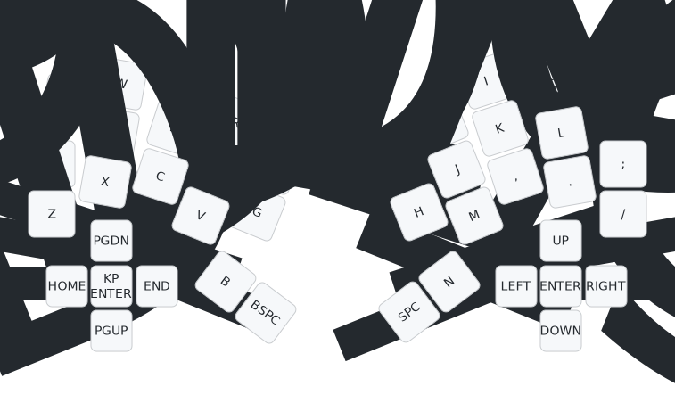

# Bivvy16D keyboard firmware

You can [download pre-compiled Bivvy16D firmware](https://github.com/peterjc/qmk_userspace/releases),
`bivvy16d_left_vial.uf2` and `bivvy16d_right_vial.uf2` with Vial support is recommended as
you can the use the [Vial GUI tool](https://get.vial.today/) to configure your layout by
point-and-click. This is the default keymap:

This is firmware for a Waveshare Raspberry Pi PR2040-Zero controller *wired split*
32 key design with a 5-way directional button on each half,

This is firmware for a split 30, 31, or 32 key design (Visorbearer like layout),
with a 5-way directional button on each half,
my [Bivvy16D keyboard](https://codeberg.org/peterjc/pico-keyboards/src/branch/main/bivvy16d).
This is a *diode-free* design with a sparse 9 by 8 scanning matrix designed using
Graph Theory to avoid ghosting. See this
[blog post](https://astrobeano.blogspot.com/2025/05/topology-meets-custom-keyboard-circuit.html)
for background and this
[blog post](https://astrobeano.blogspot.com/2025/12/5-way-switch-in-diode-free-graph-theory.html)
for the specifics of this keyboard's wiring.

The Bivvy16D can be built wireless with a pair of "nRF25840 Zero" Bluetooth controllers with
ZMK firmware (not QMK), or *wired* with a pair of WaveShare RP2040-Zero controllers with
either ZMK or (this) QMK firmware.

This matrix shows the 9×8 bipartite scanning matrix for either half, with the Raspberry Pi
"Zero" controller GPIO pins. The pin allocation was arbitrary and down to how easy it was to
layout the PCB traces:

| GP |  1 |  5 | 10 |  7 |  4 | 14 | 26 | 28 |
|---:|:--:|:--:|:--:|:--:|:--:|:--:|:--:|:--:|
|  2 | QP | WO |    |    |    |    |    |    |
|  6 |    | SL | X. |    |    |    |    |    |
|  8 |    |    | C, | DK |    |    |    |    |
|  3 |    |    |    | EI | RU |    |    |    |
|  9 |    |    |    |    | FJ | VM |    |    |
| 15 |    |    |    |    |    | GH | TY |    |
| 29 |    |    |    |    |    |    | ⌫␠ | BN |
|  0 | A; |    |    |    |    |    |    | Z/ |
| 27 | ⬆️ | ⬅️ |    | ⏺️ |    | ➡️ | ⬇️ |    |

The keys here are labeled as per Qwerty, with ⌫ (backspace) and ␠ (space) on the
thumbs, plus ⬆️/⬅️/⏺️/➡️/⬇️ as the directional button (for each half).

| Q  | W  | E  | R  | T  |   | Y  | U  | I  | O  | P  |
|:--:|:--:|:--:|:--:|:--:|:-:|:--:|:--:|:--:|:--:|:--:|
| A  | S  | D  | F  | G  |   | H  | J  | K  | L  | -  |
| Z  | X  | C  | V  | B  |   | N  | M  | ,  | .  | /  |
| ⬇️ | ⬅️ | ⏺️ | ➡️ | ⬆️ |   | ⬆️ | ⬅️ | ⏺️ | ➡️ | ⬇️ |
|    |    |    |    | ⌫  |   | ␠  |    |    |    |    |

This minimal default 32-key layout is rendered as an image above. The layout variants
drop either or both of the central thumbs (most splayed, backspace and space in the
default layout) which are listed last above - in favour of a single 1.75u wide thumb key.

* Keyboard Maintainer: [Peter J. A. Cock](https://github.com/peterjc)
* Hardware Supported: Bivvy16D (no-diode single PCB) using Raspberry Pi RP2040-Zero
* Hardware Availability: https://codeberg.org/peterjc/pico-keyboards/src/branch/main/bivvy16d
* Download Firmware pre-compiled with Vial support: *pending*

See also the [Bivvy16D ZMK firmware](https://github.com/peterjc/zmk-keyboard-graph-theory/tree/main/boards/shields/bivvy16d).

## Compiling

Make example for this keyboard (after setting up your build environment):

    make bivvy16d:default

Flashing example for this keyboard:

    make bivvy16d:default:flash

See the [build environment setup](https://docs.qmk.fm/#/getting_started_build_tools) and the [make instructions](https://docs.qmk.fm/#/getting_started_make_guide) for more information. Brand new to QMK? Start with our [Complete Newbs Guide](https://docs.qmk.fm/#/newbs).

## Bootloader

Enter the bootloader in 3 ways:

* **Bootmagic reset**: Hold down the key at (0,0) in the matrix (top left key, Qwerty `Q`) and plug in the keyboard
* **Physical reset button**: Briefly press the button on the front of the controller (if physically accessible)
* **Keycode in layout**: Press the key mapped to `QK_BOOT` if it is available
