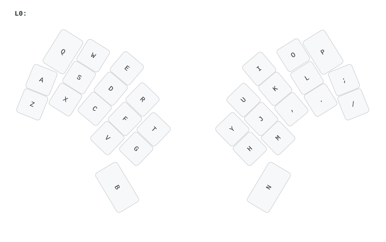

# Rugby Union keyboard firmware

You can [download pre-compiled Rugby Union firmware](https://github.com/peterjc/qmk_userspace/releases),
`rugby_union_vial.uf2` with Vial support which is recommended as you can the use
the [Vial GUI tool](https://get.vial.today/) to configure your layout by point-and-click.
This is the default keymap:

This is firmware for a Raspberry Pi PR2040 (or potentially RP2350) 'Pro Micro' controller
tented monoblock 30 key design with only one key per thumb, my
[Rugby Union keyboard](https://codeberg.org/peterjc/pico-keyboards/src/branch/main/rugby_union).

This is a *diode-free* design with a sparse 10 by 15 scanning matrix designed using this
[25 vertex girth 10 graph with 30 edges](https://houseofgraphs.org/graphs/45469).
Using 25 vertices or GPIO pins, with 30 edges or keys, we get 8KRO. See this
[blog post](https://astrobeano.blogspot.com/2025/05/topology-meets-custom-keyboard-circuit.html)
for background.

This matrix shows the 10×15 sparse bipartite scanning matrix. The keys are assigned so the
scanning column order matches the physical columns (starting with Q, A and Z as the first
column), with the scanning rows sorted to ensure Q is top left as the first matrix entry.
The allocation of keys to matrix elements and scanning matrix rows and columns
to GPIO pins was arbitrary and down to how easy it was to layout the PCB traces:

|R/C|C0 |C1 |C2 |C3 |C4 |C5 |C6 |C7 |C8 |C9 |
|--:|:-:|:-:|:-:|:-:|:-:|:-:|:-:|:-:|:-:|:-:|
|R0 | Q | W |   |   |   |   |   |   |   |   |
|R1 |   | S | E |   |   |   |   |   |   |   |
|R2 |   |   | D | R |   |   |   |   |   |   |
|R3 |   |   |   | F | T |   |   |   |   |   |
|R4 | A |   |   |   | G |   |   |   |   |   |
|R5 | Z |   |   |   |   | Y |   |   |   |   |
|R6 |   | X |   |   |   |   |   | I |   |   |
|R7 |   |   | C |   |   |   |   |   |   | P |
|R8 |   |   |   | V |   |   | U |   |   |   |
|R9 |   |   |   |   | B |   |   |   | O |   |
|R10|   |   |   |   |   | H | J |   |   |   |
|R11|   |   |   |   |   |   | M | K |   |   |
|R12|   |   |   |   |   |   |   | , | L |   |
|R13|   |   |   |   |   |   |   |   | . | ; |
|R14|   |   |   |   |   | N |   |   |   | / |

Note there are two entries for each row, and three for each column.
The keys here are labeled as per Qwerty, with B and N for the thumbs,

| Q | W | E | R | T |       | Y | U | I | O | P |
|:-:|:-:|:-:|:-:|:-:|:-----:|:-:|:-:|:-:|:-:|:-:|
| A | S | D | F | G |       | H | J | K | L | - |
| Z | X | C | V | B |       | N | M | , | . | / |

This minimal default layout is rendered as an image above.

* Keyboard Maintainer: [Peter J. A. Cock](https://github.com/peterjc)
* Hardware Supported: Rugby Union (no-diode twin PCB) using Raspberry Pi Pico
* Hardware Availability: https://codeberg.org/peterjc/pico-keyboards/src/branch/main/rugby_union
* Download Firmware pre-compiled with Vial support: [rugby_union_vial.uf2](https://github.com/peterjc/qmk_userspace/releases/download/latest/rugby_union_vial.uf2)

See also the [Rugby Union ZMK firmware](https://github.com/peterjc/zmk-keyboard-graph-theory/tree/main/boards/shields/rugby_union)
and [Rugby Union RMK firmware](https://github.com/peterjc/rmk-pico-keyboards/tree/main/Rugby_Union_RP2040).

## Compiling

Make example for this keyboard (after setting up your build environment):

    make rugby_union:default

Flashing example for this keyboard:

    make rugby_union:default:flash

See the [build environment setup](https://docs.qmk.fm/#/getting_started_build_tools) and the [make instructions](https://docs.qmk.fm/#/getting_started_make_guide) for more information. Brand new to QMK? Start with our [Complete Newbs Guide](https://docs.qmk.fm/#/newbs).

## Bootloader

Enter the bootloader in 3 ways:

* **Bootmagic reset**: Hold down the key at (0,0) in the matrix (top left key, Qwerty `Q`) and plug in the keyboard
* **Physical reset button**: Briefly press the button on the front of the controller (if physically accessible from the front of the keyboard)
* **Keycode in layout**: Press the key mapped to `QK_BOOT` if it is available
