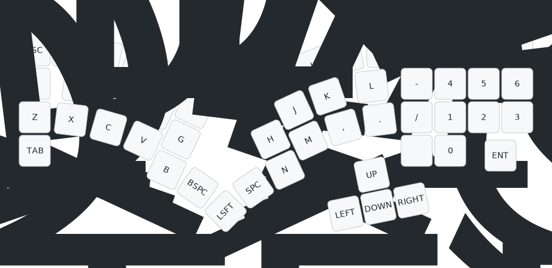

# Slump52 keyboard firmware

You can [download pre-compiled Slump52 firmware](https://github.com/peterjc/qmk_userspace/releases),
`slump52_vial.uf2` with Vial support is recommended as you can the use the
[Vial GUI tool](https://get.vial.today/) to configure your layout by point-and-click.
This is the default keymap:

This is firmware for a Raspberry Pi Pico PR2040 controller monoblock 52 key design
(split 3x5 - three rows of five, with thumb keys, cursors, and numpad),
[my curvy Slump52 keyboard](https://codeberg.org/peterjc/pico-keyboards/src/branch/main/slump52).
This is a *diode-free* design with a sparse 13 by 13 scanning matrix designed using the
[Incidence graph of the projective plane of order 3, PG(2,3)](https://houseofgraphs.org/graphs/44089)
(using only 26 vertices or GPIO pins, with 52 edges or keys - see this
[blog post](https://astrobeano.blogspot.com/2025/05/topology-meets-custom-keyboard-circuit.html)
for background.

This matrix shows the 13×13 PG(2,3) bipartite scanning matrix in Paige-Wexler
normal form. The keys are assigned so the scanning column order roughly matches
the physical columns (starting with Escape, Q, A, Z, as the first column), with
the scanning rows sorted to ensure Escape is top left as the first matrix entry.
The allocation of keys to matrix elements and scanning matrix rows and columns
to GPIO pins was arbitrary and down to how easy it was to layout the PCB traces:

| GP |  28 |  26 | 16 | 15 |  8 |  7 |  6 |  5 |  4 |  3 |  2 |  1 |   O   |
|---:|:---:|:---:|:--:|:--:|:--:|:--:|:--:|:--:|:--:|:--:|:--:|:--:|:-----:|
| 27 | Esc |  W  |  E |  R |    |    |    |    |    |    |    |    |       |
| 22 |  Q  |     |    |    | T  |  Y |  U |    |    |    |    |    |       |
| 21 |  A  |     |    |    |    |    |    |  I |  O |  P |    |    |       |
| 20 |  Z  |     |    |    |    |    |    |    |    |    | 7  |  8 |   9   |
| 19 |     |  S  |    |    | T1 |    |    |  K |    |    | 4  |    |       |
| 18 |     |  X  |    |    |    |  H |    |    |  L |    |    |  5 |       |
| 17 |     | Tab |    |    |    |    |  J |    |    | += |    |    |   6   |
| 14 |     |     | D  |    | T2 |    |    |    |  . |    |    |    |   3   |
| 13 |     |     | C  |    |    |  N |    |    |    |  - | 1  |    |       |
| 12 |     |     | V  |    |    |    |  M |  , |    |    |    |  2 |       |
| 11 |     |     |    |  F | T3 |    |    |    |    |  / |    |  0 |       |
| 10 |     |     |    |  G |    |  ← |    |  ↑ |    |    |    |    | Enter |
|  9 |     |     |    |  B |    |    |  ↓ |    |  → |    |  * |    |       |

The keys here are labeled as per Qwerty, with T1, T2, and T3, for the thumbs,
plus the cursors (in a standard inverted-tee layout, not a row):

| Esc |  Q  | W | E | R | T |    |    |    | Y | U | I | O | P | += | 7 | 8 | 9     |
|:---:|:---:|:-:|:-:|:-:|:-:|:--:|:--:|:--:|:-:|:-:|:-:|:-:|:-:|:--:|:-:|:-:|:-----:|
|     |  A  | S | D | F | G |    |    |    | H | J | K | L | - |    | 4 | 5 | 6     |
|     |  Z  | X | C | V | B |    |    |    | N | M | , | . | / |    | 1 | 2 | 3     |
|     | Tab |   |   |   |   | T1 | T2 | T3 | ← | ↓ | ↑ | → | * |    | 0 |   | Enter |

This default layout replaces Qwerty semicolon/colon with hyphen/underscore (for
use with the numpad as minus), adds an extra key below slash/question-mark (used
for division with the numpad) for multiplication, and places the equals-sign/plus
key at the top of this column (but with plus by default and equals with shift).

The suggested thumb keys are backspace, shift, and space. The keys labeled as
`Tab` (left) and `*` (right) could be used as a pinky shift instead (or when held).

Most of the symbols can be used with shift and the numpad, but this and the
remaining punctuation (semicolon, brackets, backslash, pipe, hash, tilde, etc)
can be placed on layers or combos when personalising the layout.

The Raspberry Pi Pico controller's user LED on GPIO pin 25 is set to show the Caps Lock state.

* Keyboard Maintainer: [Peter J. A. Cock](https://github.com/peterjc)
* Hardware Supported: Slump52 (no-diode single PCB) using Raspberry Pi Pico
* Hardware Availability: https://codeberg.org/peterjc/pico-keyboards/src/branch/main/slump52
* Download Firmware pre-compiled with Vial support: [slump52_vial.uf2](https://github.com/peterjc/qmk_userspace/releases/download/latest/slump52_vial.uf2)

See also the [Slump52 ZMK firmware](https://github.com/peterjc/zmk-keyboard-graph-theory/tree/main/boards/shields/slump52).

## Compiling

Make example for this keyboard (after setting up your build environment):

    make slump52:default

Flashing example for this keyboard:

    make slump52:default:flash

See the [build environment setup](https://docs.qmk.fm/#/getting_started_build_tools) and the [make instructions](https://docs.qmk.fm/#/getting_started_make_guide) for more information. Brand new to QMK? Start with our [Complete Newbs Guide](https://docs.qmk.fm/#/newbs).

## Bootloader

Enter the bootloader in 3 ways:

* **Bootmagic reset**: Hold down the key at (0,0) in the matrix (top left key, Qwerty `Escape`) and plug in the keyboard
* **Physical reset button**: Briefly press the button on the front of the controller (if physically accessible)
* **Keycode in layout**: Press the key mapped to `QK_BOOT` if it is available
